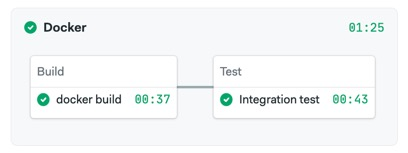

# Dockerizing a Node.js Application Example

[](https://tomfern.semaphoreci.com/projects/dockerizing-nodejs)

This is an example project for the following post in the Semaphore CI/CD blog:

[Dockerizing a Node.js Web Application](https://semaphoreci.com/community/tutorials/dockerizing-a-node-js-web-application)



## Run uncontained

Setup:

```bash
$ cd src
$ npm install
```

Start a PostgreSQL database and create the tables:

```bash
$ docker run -it -e "POSTGRES_HOST_AUTH_METHOD=trust" -p 5432:5432 postgres
$ npm run migrate
```

Start application:

```bash
$ npm start
```

## API Usage

- `GET /persons/all` retrieve all persons in the addressbook
- `GET /persons/1` retrieve person with id 1
- `PUT /persons/` add a person to the addressbook
- `DELETE /persons/1` delete person with id 1

Example:

```bash
curl -X PUT http://localhost:3000/persons -H 'Content-Type: application/json' -d '{"id": 1, "firstName": "David", "lastName": "Bowie"}'
```

```bash
curl -X GET http://localhost:3000/persons -H 'Content-Type: application/json'
{"firstName":"David","lastName":"Bowie","id":1,"updatedAt":"2023-04-30T22:44:29.115Z","createdAt":"2023-04-30T22:44:29.115Z"}
```

## Build Docker Image

```bash
$ docker build -t addressbook .
$ docker run -it -p 3000:3000 addressbook
```

## Run with Docker Compose: app + database

```bash
$ docker compose run addressbook npm run migrate
$ docker compose up --build
```

## Run tests with Docker

```bash
$ docker compose run addressbook npm test
```

## LICENSE

Copyright 2023 Rendered Text

Permission is hereby granted, free of charge, to any person obtaining a copy of this software and associated documentation files (the "Software"), to deal in the Software without restriction, including without limitation the rights to use, copy, modify, merge, publish, distribute, sublicense, and/or sell copies of the Software, and to permit persons to whom the Software is furnished to do so, subject to the following conditions:

The above copyright notice and this permission notice shall be included in all copies or substantial portions of the Software.

THE SOFTWARE IS PROVIDED "AS IS", WITHOUT WARRANTY OF ANY KIND, EXPRESS OR IMPLIED, INCLUDING BUT NOT LIMITED TO THE WARRANTIES OF MERCHANTABILITY, FITNESS FOR A PARTICULAR PURPOSE AND NONINFRINGEMENT. IN NO EVENT SHALL THE AUTHORS OR COPYRIGHT HOLDERS BE LIABLE FOR ANY CLAIM, DAMAGES OR OTHER LIABILITY, WHETHER IN AN ACTION OF CONTRACT, TORT OR OTHERWISE, ARISING FROM, OUT OF OR IN CONNECTION WITH THE SOFTWARE OR THE USE OR OTHER DEALINGS IN THE SOFTWARE.
